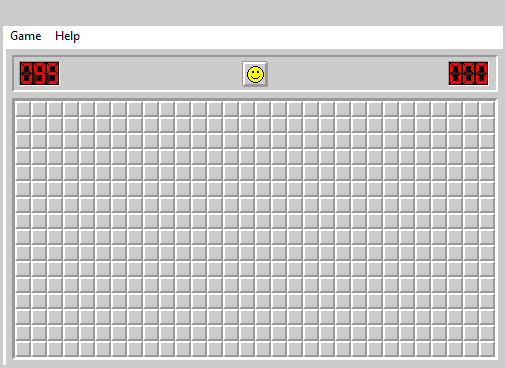
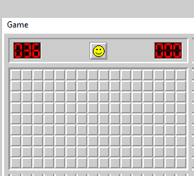

# minesweeper_bot
A bot that locates a running minesweeper, reads the screen, deduces the
possibilities, and operates the mouse. Included is a gimp plug-in to make
animated gif images from the bot's recorded images.

Minesweeper Expert.

**Ran with:** `python minesweeper_bot.py -r E:\Desktop\Msweeper\Animate`
**Gif built with:** (Please read the plug-in requirements for path discrepancy)
`gimp -i -b '(python-fu-animate-bot-recording RUN-NONINTERACTIVE "/home/jonathan/Pictures/Msweeper/Animate" "Expert.gif" 1 5 1)' -b '(gimp-quit 1)'`

####Bot Requires####

Python3: <https://www.python.org/downloads/>

Window Extensions for Python:
- from pip: `python -m pip install pypiwin32`
- from unofficial binaries: <http://www.lfd.uci.edu/~gohlke/pythonlibs/>
- from: <http://sourceforge.net/projects/pywin32/>

And Minesweeper itself:
- from: an Windows XP installation. (Or maybe any Windows System before Window 7)
  <http://www.makeuseof.com/tag/minesweeper-restoring-the-classic-windows-games-in-windows-8/>

**Run from the command line** in it's directory, optional options include:
- -d display: Will print the minefield at the end as the bot sees it.
- -f flag: Will flag the mines instead of avoiding them.
- -r record: Will save the screen captures to the specified existing directory.
- -p pause: Will pause between actions slowing it down (so you can blink).

Minesweeper Custom: Height `9`, Width `16`, Mines `36`.

**Ran with:** `python minesweeper_bot.py -f -r E:\Desktop\Msweeper -p 1/16`
**Gif built with**
`gimp -i -b '(python-fu-animate-bot-recording RUN-NONINTERACTIVE "/home/jonathan/Pictures/Msweeper/" "Custom.gif" 0 1 1)' -b '(gimp-quit 1)'`

####Plug-in Requires####

Python3: <https://www.python.org/downloads/>

Gimp: <http://www.gimp.org/downloads/>

Python-Gimp support:
- For Windows read this:
  <http://www.gimpusers.com/tutorials/install-python-for-gimp-2-6-windows>
- Or like me: Virtualize linux with gimp (cause gimp comes python supported),
and mount the shared windows folder (e.g. Msweeper).

**Run from gimp Menu "File/Create/animate bot recording..."** which brings up a
nice dialog box for the arguments.
**Otherwise from the command line (/terminal).** Look up `animate-bot-recording` 
within the Precedure Browser within gimp's help menu for script arguments.

How the bot works:
  The logic starts simple solving around a single cell. When not enough implores
adjacent cells and solves those not within their combined influence. When there
is lacking information it explores for more. Although, there is a mine
detecting pixel cheat in this version of minesweeper the bot **does not** use
it. If it had feelings it too would hate those 50/50 chances.

Millisecond pauses slow down the bot allowing the game to catch-up. Becuase
these are optimized and tested on my own system, adjustments my be necessary if
AssertionErrors occur often.

